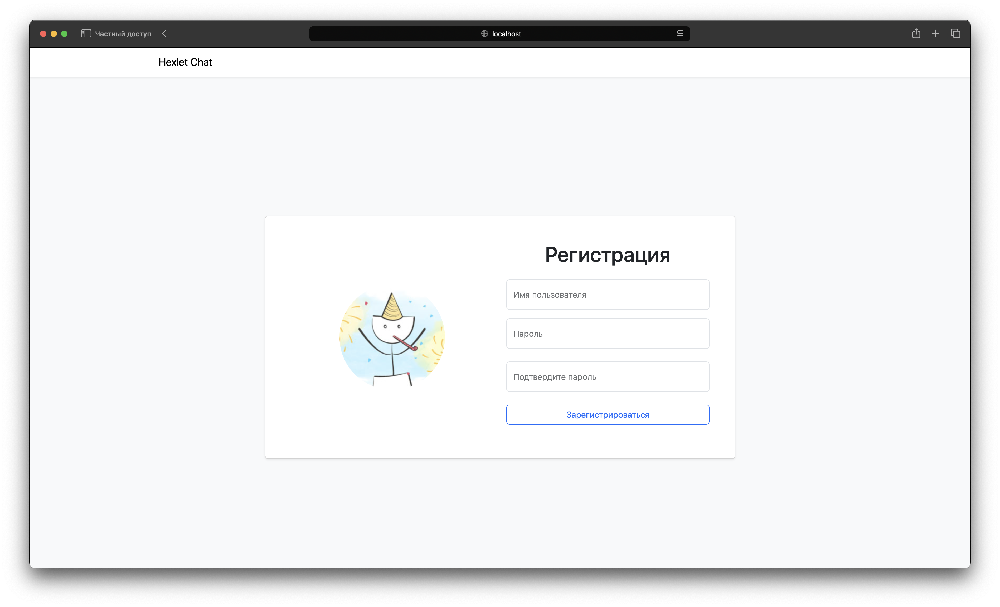

### Hexlet tests and linter status:
[](https://github.com/ShePlayedYou/frontend-project-12/actions)

### Hexlet Chat app live on Render.com: <https://hexlet-chat-jq4h.onrender.com>

**Hexlet Chat** — это сервис для обмена сообщениями (упрощённый аналог Slack). Для комфортного общения есть регистрация пользователей, авторизация, создание новых каналов, а также управление уже созданными каналами.

### Используемые технологии
1. JavaScript - современный стек: React, RTK Query, Formik, Yup. 
2. CI/CD - Render, GitHub Actions
3. Тестирование - EsLint
4. Сборка - Vite
5. Дизайн и вёрстка - адаптивный интерфейс на Bootstrap 5 и компоненты React-Bootstrap
6. Локализация интерфейса - i18next (русский и английский языки)
7. Управление состоянием - Redux Toolkit и RTK Query для кэширования и синхронизации данных с сервером
8. WebSocket - Real-time обновление данных через Socket.io.
9. Отображение уведомлений о действиях пользователей через помощью React-Toastify.
---
### Основные функции

#### Аутентификация
- Регистрация новых пользователей
- Вход в систему
- Сохранение токена аутентификации и имени пользователя в `LocalStorage`
- Защита приватных маршрутов с перенаправлением на страницу входа при отсутствии токена
- Для аутентификации используется механизм `JWT Token`

#### Работа с сообщениями
- Отправка сообщений в выбранный канал
- Автоматическая прокрутка к последнему сообщению
- Отображение новых сообщений в реальном времени с помощью WebSocket
- Базовая цензура сообщений с использованием `leo-profanity`

#### Работа с каналами
- Получение списка каналов с сервера
- Создание нового канала
- Переименование существующего канала
- Удаление канала
- Автоматический выбор дефолтного канала при удалении текущего активного (для всех пользователей)
- Обновление списка каналов через WebSocket при действиях пользователей
- Валидация имён каналов (длина, уникальность)
- Базовая цензура имён каналов с использованием `leo-profanity`

#### Валидация и UX
- Использование `Yup` и `Formik` для валидации форм
- Мгновенная обратная связь при ошибках ввода
- Информативные сообщения об ошибках (в том числе сетевых)
- Адаптивный интерфейс
- Модальные окна для выполнения контекстных действий

#### Уведомления
- Отображение всплывающих уведомлений (toast) при:
  - Создании, переименовании, удалении канала
  - Ошибках (например, проблемы с сетью)
---

### Команды для сборки, запуска, разработки
#### Локальный запуск проекта
1. Клонируйте репозиторий к себе на компьютер
2. Перейдите в корневую директорию проекта
3. Установите зависимости проекта, выполнив в консоли команду 
    ```
    make install
    ```
4. Запустите сборку проекта через `Vite`, выполнив команду 
    ```
    make build
    ```
4. Запустите бэкенд, выполнив команду
    ```
    make start
    ```
5. Перейдите в браузере по адресу http://localhost:5001/

#### Команды Makefile (корень проекта)

| Команда     | Действие                                                                 |
|-------------|--------------------------------------------------------------------------|
| `make install` | Устанавливает зависимости корневого проекта и фронтенда (`npm ci`)       |
| `make build`   | Удаляет предыдущую сборку и собирает проект во `frontend/dist`           |
| `make start`   | Запускает production-сервер, обслуживающий `frontend/dist` через `start-server` |
| `make dev`     | Запускает фронтенд в режиме разработки (`vite dev`)                      |

---

#### Команды Makefile (внутри `frontend/`)
| Команда       | Действие                                                                 |
|---------------|--------------------------------------------------------------------------|
| `make install` | Устанавливает зависимости фронтенда (`npm ci`)                           |
| `make build`   | Удаляет папку `./dist` и собирает проект (`npm run build`)               |
| `make start`   | Запускает production-сервер для `./dist` через `start-server`            |
| `make lint`    | Запускает `ESLint` для анализа и проверки всего проекта (`npx eslint .`) |


### Скриншоты приложения



